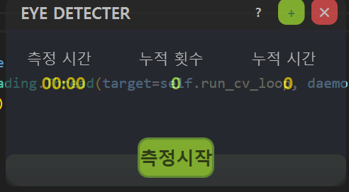
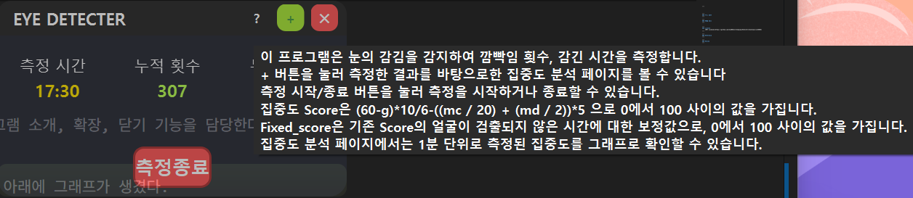
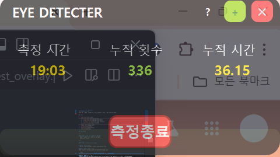
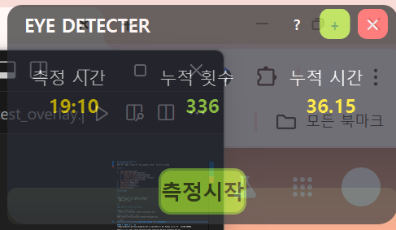
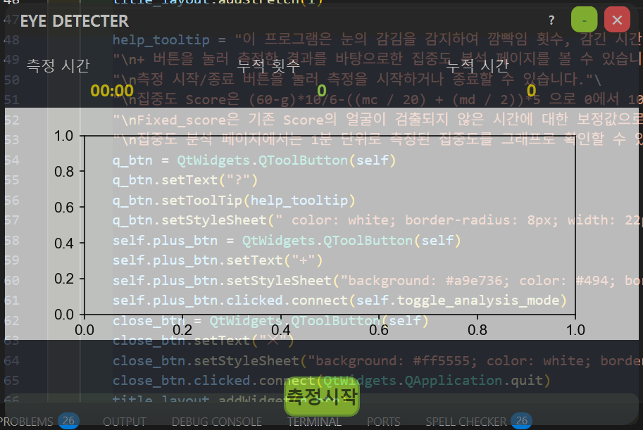
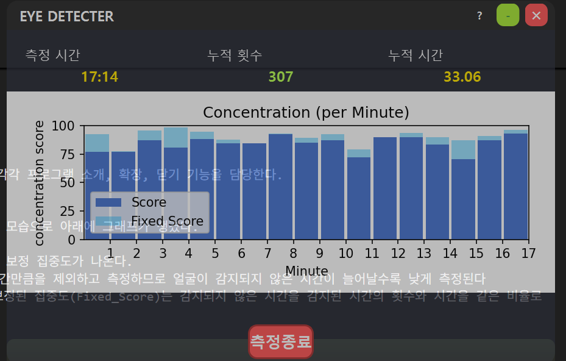
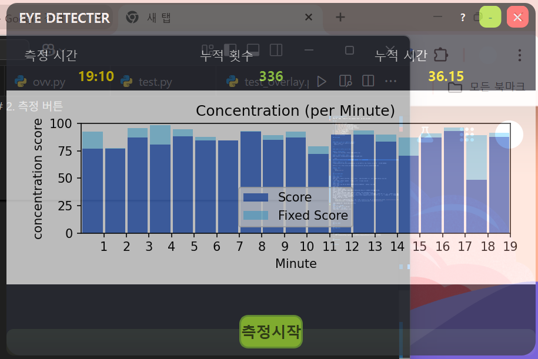

# Concentration-Detecter
### 집중도 탐지기
눈을 감은 횟수, 시간을 감지하여 집중도를 확인할 수 있는 프로그램

## 목차

1.  [실행하기](#실행하기)
2.  [프로그램 설명](#프로그램-설명)
    1.  [게임 입장 화면](#게임-입장-화면)
    2.  [게임 시작 화면](#게임-시작-화면)
    3.  [주사위 저장 화면](#주사위-저장-화면)
    4.  [다시 굴리기](#다시-굴리기)
3.  [코드 설명](#코드-설명)
4.  [기술 스택](#기술-스택)
5.  [License](#License)
6.  [Reference](#Reference)
7.  [Review](#review)

### 실행하기

---

#### 방법 1: exe 파일 다운로드 후 실행
- 아래 링크에서 파일 다운로드 후 실행  
  [다운로드 링크]

---

#### 방법 2: 파이썬 파일로 실행

##### 1. Python 설치
- Python 3.8 이상 설치: https://www.python.org/

##### 2. 필요한 패키지 설치
아래 명령어를 터미널(cmd)나 VSCode의 터미널에 입력

```bash
pip install opencv-python numpy dlib pygame PyQt6 matplotlib
```
##### 3. 모델 파일 준비
-shape_predictor_68_face_landmarks.dat 파일을 다운로드 후, Python 파일과 같은 폴더에 넣기기.

다운로드 링크: http://dlib.net/files/shape_predictor_68_face_landmarks.dat.bz2

##### 4. 실행
```bash
    python main.py
```
---
### 프로그램 설명
---
#### 1.실행 화면

기본 실행 시 나오는 화면이다. ?, +, X 버튼은 각각 프로그램 소개, 확장, 닫기 기능을 담당한다.

? 버튼 위에 마우스를 가져다 대면 다음과 같은 소개가 출력된다.
#### 2. 측정 버튼

연두색 측정시작 버튼을 누르면 기존의 기록을 초기화하고 측정을 시작한다.

측정 버튼이 클릭되면 버튼은 빨간색 측정종료 버튼으로 바뀐다.
동시에 측정이 시작되며 카메라 프레임마다 얼굴을 감지하여 눈이 감겼는지, 떠졌는지, 감지가 안됐는지를 확인해 측정 시간, 누적 횟수, 누적 시간을 표시한다.
1분마다 최근 1분간의 기록을 배열에 저장하는데 확장 화면에서 나올 히스토그램에 사용된다.

측정 종료를 누르면 측정이 종료되고 측정시작 버튼으로 바뀐다.
다시 시작을 누르면 초기화 후 시작된다.
#### 3.확장 화면

확장 시 나오는 화면이다. 기존 화면이 확장되어진 모습으로 아래에 그래프가 생겼다. 또한 - 버튼으로 바뀌는데 누르면 다시 작아진다.

(그래프 예시 사진)
측정 확장 시 나오는 화면이다. 히스토그램으로 집중도(Score), 보정 집중도(Fixed_Score)가 나온다.
파란색 집중도(Score)는 얼굴이 감지되지 않은 시간만큼을 제외하고 측정하므로 얼굴이 감지되지 않은 시간이 늘어날수록 낮게 측정된다
하늘색으로 파란색 집중도(Score)위에 표시되는 보정된 집중도(Fixed_Score)는 감지되지 않은 시간을 감지된 시간의 횟수와 시간을 같은 비율로 보냈다고 가정해 보정한 집중도이다. 
각각의 코드는 다음과 같다

```bash
    score_vals = [(60-g)*10/6-((mc / 20) + (md / 2))*5 for mc, md, g in zip(minute_counts, minute_durations, face_non_durations)]
    fixed_score_vals = [s/(60-g)*60-s for s,g in zip(score_vals, face_non_durations)]
```

그래프는 1분마다 실시간으로 업데이트된다.

측정을 종료하면 멈춘 그래프를 확인할 수 있다
-눈을 3초동안 감고 있으면 졸음으로 판단

#### 4.알람 울리기
    3초동안 눈을 감고있는 상태가 지속되면 data/alarm.mp3를 실행한다.


---


---
### 코드 설명
---

---
### 기술 스택
---


---
### License
[MIT License](https://github.com/kim001hs/Sleeping-Detecter/blob/main/LICENSE)
---

---
### Reference
---

---
### Review
---